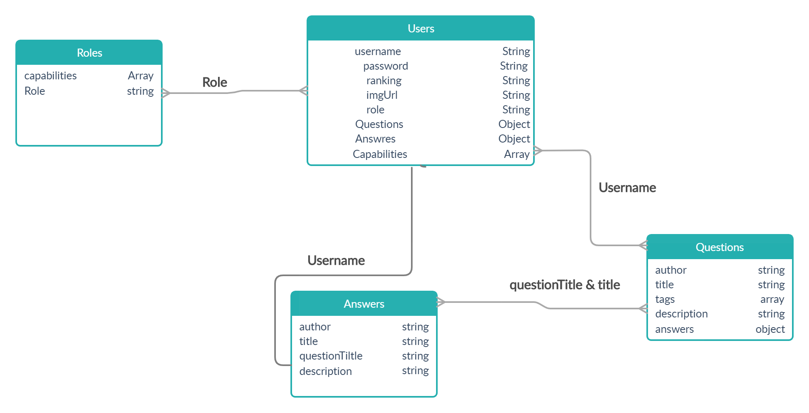
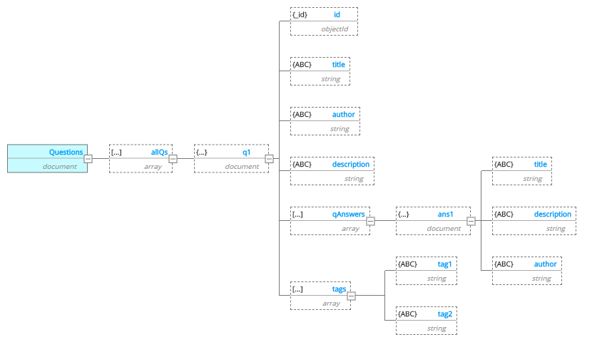
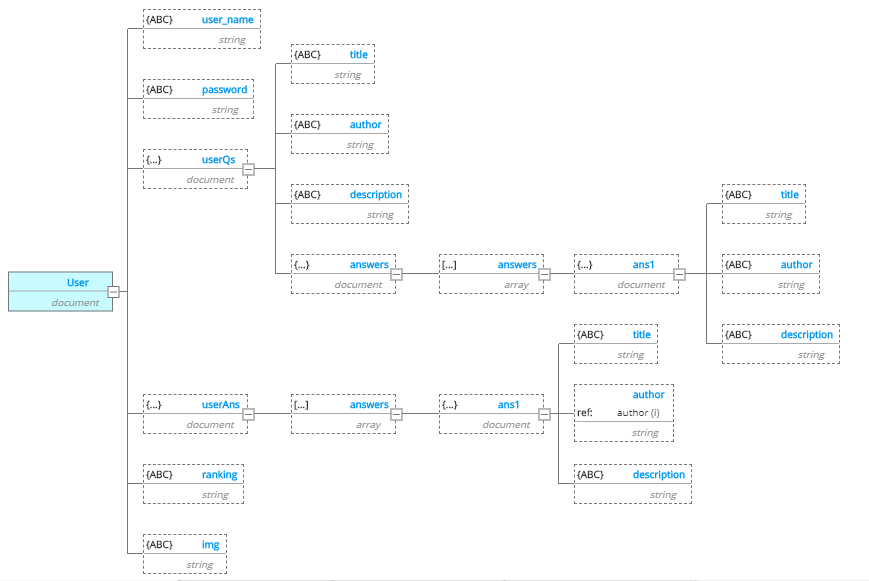

# SynHub

- Project Name: SynHub

- Team Members:

    - Darah Shalabi
    - Yousef AlShun
    - Muhammed Tommalieh
    - Batool Al-Ali

- This application will help users throughout the process of creating their projects. Moving from the planning phase to the implementation to the reports and documentations. To make this app more developer friendly, we added a feature that can help instructors demonstrate for their students in an interactive environment. This application will allow you to manage your project from A to Z all in one place.

- There is many different developers' applications that can help you with managing your project, but it can get overwhelming when one has to navigate through all these applications to make use of all the features. SynHub provides the user with all these features gathered in one place, so you won't struggle between all those apps. SynHub will help the user in seeking guidance, managing tasks, asking questions and looking for answers. SynHub is proud to introduce the 'Code Together' feature. This feature will provide the users with the ability of trying a realtime text-editor accompanied with a live chat section.

- Semantic versioning, beginning with version 1.0.1 and incremented as changes are made v1.0.1 readme updates

- Given that a user opens the application in their browser When they will be displayed with the applications homepage Then the website will allow them to know more and navigate through the pages with easy accessability

- As a user, I want to find a question I am looking for.
- As a user, I want to ask a question so that I can get suggested answers.
- As a user, I want to have the opportunity to answer questions.
- As a user, I want to have the opportunity to chat with other users.
- As a user, I want to have the opportunity to enter rooms.
- As an admin, I want to have the opportunity to create rooms.
- As an admin, I want to have the opportunity to delete an unwanted room/question/answer.

- DB Relationship Diagram

- Wireframe 

